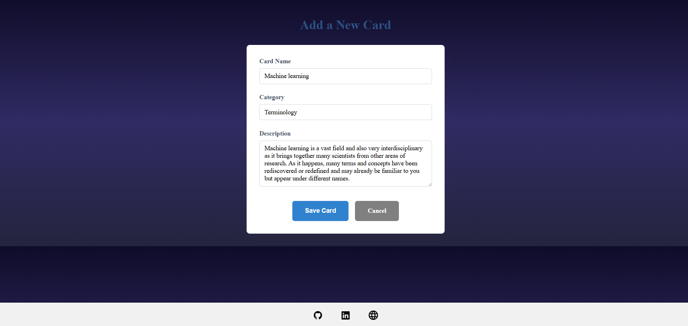
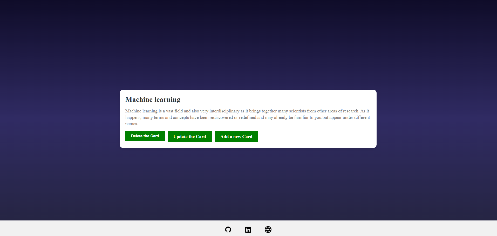

# My FlashStudy App

A lightweight Spring Boot-based web application for managing flashcards. Users can register, log in, and create personalized flashcards to aid in study and review. The app also exposes a RESTful API for programmatic access.

---

## Features

- User registration & login (with session-based authentication)
- Create, read, update, and delete flashcards
- Filter flashcards by user
- RESTful API for backend access
- H2 database integration with a built-in console
- Thymeleaf templates for interactive UI
- Global exception handling for validation errors

---

##  Screenshots

### Login Page


### Add Flashcard


### Flashcard List


> Place the above images in a `images/` folder inside the repository.

---

## REST API Endpoints

Base URL: `/rest`

### Get All Cards
GET /rest/cards/all

### Get All Users
GET /rest/users/all

### Get Cards by User ID
GET /rest/user/{id}

### Create a New Card
POST /rest/cards/create  
Content-Type: application/json

```json
{
  "name": "Card Title",
  "category": "Category",
  "description": "Card description",
  "user": {
    "id": 1
  }
}
```

### Delete a Card
DELETE /rest/cards/delete/{id}

---

## Setup

### Prerequisites

- Java 17+
- Maven

### Run the App

```bash
mvn spring-boot:run
```

Access the app at: `http://localhost:8080`

Access the H2 console at: `http://localhost:8080/h2-console`  
JDBC URL: `jdbc:h2:file:./database/testdb`

---

## Security

- Basic user authentication using `BCryptPasswordEncoder`
- Users are session-authenticated via a login form
- Disabled CSRF for API routes (can be enabled in production)

---

## Tech Stack

- Spring Boot
- Spring Data JPA
- Spring Security
- Thymeleaf
- H2 Database

---

## Project Structure

```
src
├── controller
│   ├── View_Controller.java
│   └── Rest_Controller.java
├── model
│   ├── entity
│   ├── repository
│   └── service
├── exception
├── Configuration.java
└── application.properties
```

---

## Contributions

Feel free to fork and submit PRs to improve features, fix bugs, or add enhancements!

---

## License

This project is licensed under the MIT License.
